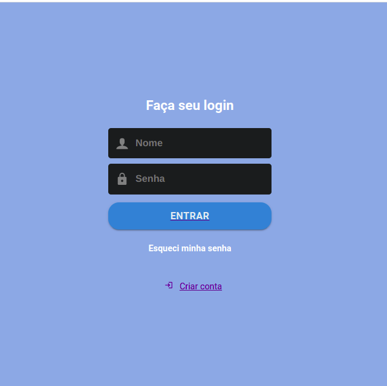
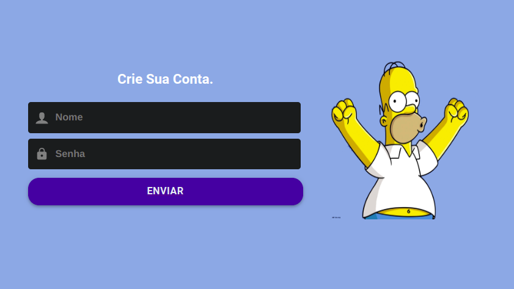
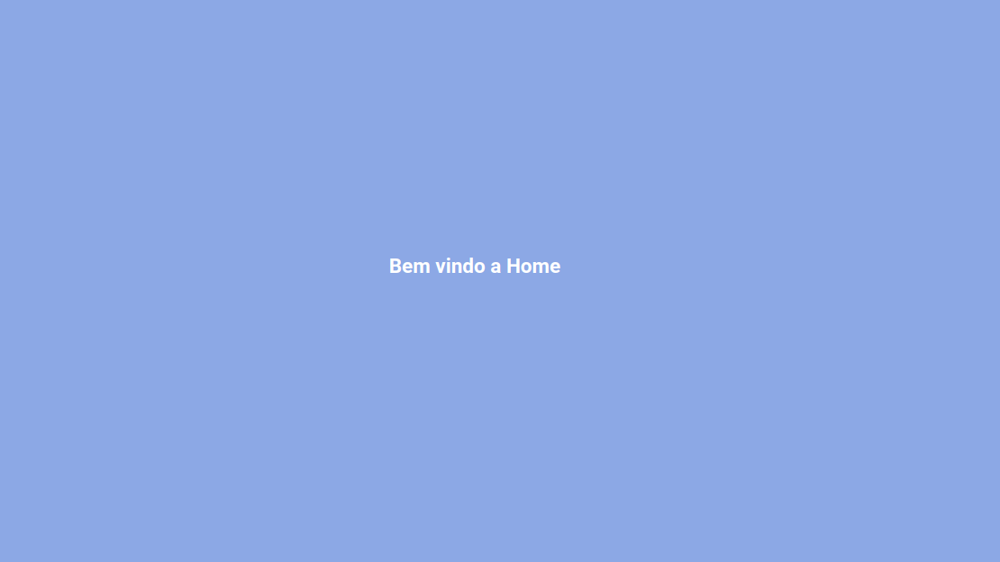

<h3 align="center">
 ONE BLUE-LOGIN-Web - ReactJS
</h3>

### :computer: How To Run

 * Primeiro instale as dependencias:
 ```bash
npm
 ```

### :computer: Scripts de inicialização:
  * Inicie a aplicação em modo desenvolvimento!
 ```bash
npm start
 ```
 * Abra [http://localhost:3000/login](http://localhost:3000/user/cadaster) para vizualizar em seu navegador


## 🤔 Tem alguma feature e quer contribuir?

- Faça um fork desse repositório;
- Cria uma branch com a sua feature: `git checkout -b minha-feature`;
- Faça commit das suas alterações: `git commit -m 'feat: Minha nova feature'`;
- Faça push para a sua branch: `git push origin minha-feature`.

Depois que o merge da sua pull request for feito, você pode deletar a sua branch.

---


<p align="center">
   
   
   

</p>

♥ by Marcelo Cequeira :wave: